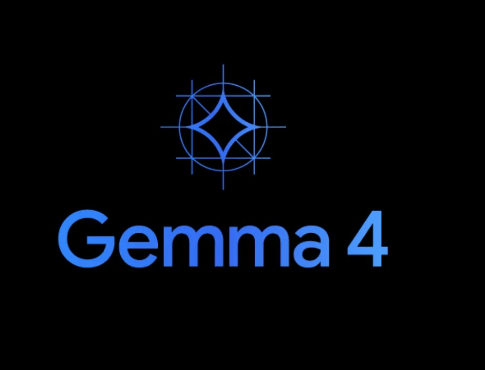

# SIGAP

<p align="center">
  
</p>

<p align="center">
  
</p>

<p align="center">
  <strong>Offline Emergency Companion for Android</strong><br>
  Built with Flutter, Gemma 4, LiteRT-LM, and flutter_gemma
</p>

SIGAP is an offline-first Android emergency companion built with Flutter.
It uses Gemma 4 through `flutter_gemma` and LiteRT-LM to provide
structured first-step guidance when internet connectivity cannot be
trusted.

The project is designed for a simple core use case:
in an emergency, users do not need more information first. They need the
next safe action.

## Problem

Medical emergencies often happen in imperfect conditions: at home, on the
road, or during long-distance travel when users are stressed and signal is
weak. In those moments, web search is slow, fragmented, and often unsafe
to rely on.

SIGAP is built for that first critical window before professional help is
reached. The current product direction focuses on conservative first-aid
guidance, urgency signaling, and offline usability rather than diagnosis.

## Solution

SIGAP combines on-device inference, local retrieval, and multimodal input
inside one Android app. The current codebase includes:

- on-device Gemma 4 integration with `flutter_gemma`
- LiteRT-LM model download/import flow
- model selection between `Gemma 4 E2B-IT` and `Gemma 4 E4B-IT`
- offline-capable assistant chat flow
- beta multimodal paths for text, voice, and photo input
- local first-aid and myth-correction retrieval with SQLite
- Bahasa Indonesia text-to-speech playback
- emergency contact flow with GPS and WhatsApp support
- urgency-oriented response presentation in the assistant UI

## Why Gemma 4

SIGAP depends on true on-device inference. The implementation in this repo
uses Gemma 4 with `flutter_gemma` because the assistant must remain useful
even when the network is unreliable.

Important implementation detail:

- the app runtime is built around LiteRT-LM artifacts
- the supported production artifact format for this app is `.litertlm`
- Hugging Face `safetensors` model repos are not treated as the final
  runtime artifact for this Flutter app

The current setup supports these variants:

- `Gemma 4 E2B-IT`
- `Gemma 4 E4B-IT`

Default model sources in code:

- `https://huggingface.co/litert-community/gemma-4-E2B-it-litert-lm`
- `https://huggingface.co/litert-community/gemma-4-E4B-it-litert-lm`

## Technical Architecture

High-level flow:

1. The user opens SIGAP on Android.
2. The app loads or installs a local Gemma 4 LiteRT-LM model.
3. User input is collected through text, voice, or photo flow.
4. The assistant retrieves local first-aid context from the on-device
   knowledge base.
5. Gemma generates structured guidance on-device.
6. The app can speak the response aloud and help prepare emergency
   escalation.

Main implementation areas in this repo:

- `lib/screens/`
  UI for splash, home, assistant, and education flows
- `lib/services/gemma_service.dart`
  local model lifecycle, install/import, backend selection, and inference
- `lib/services/rag_service.dart`
  SQLite knowledge base, retrieval, and vector-store fallback path
- `lib/services/tts_service.dart`
  Bahasa Indonesia text-to-speech
- `lib/viewmodels/assistant_view_model.dart`
  assistant interaction and UI state orchestration

## Repository Structure

```text
lib/
  core/
  screens/
  services/
  viewmodels/
assets/
  logo/
android/
```

## Current Status

Verified from the current repo:

- Gemma model selection, download, import, and deletion flows exist
- the app attempts GPU first and falls back to CPU
- SQLite-backed local knowledge retrieval exists
- the assistant UI supports chat and emergency-oriented interaction
- TTS support exists for Bahasa Indonesia
- photo analysis and audio input paths exist as beta flows

Not claimed as fully verified by this README:

- end-to-end runtime behavior on every target Android device
- medical validation by licensed professionals
- production readiness for all multimodal cases

## Setup Requirements

Before running the app, prepare:

- Flutter SDK compatible with the repo `pubspec.yaml`
- Android device or emulator
- enough device storage for the selected Gemma 4 model
- a LiteRT-LM model file or a network path to the model artifact

Primary dependencies declared in the repo include:

- `flutter_gemma`
- `flutter_tts`
- `image_picker`
- `geolocator`
- `sqflite`
- `shared_preferences`
- `file_picker`
- `url_launcher`
- `permission_handler`
- `connectivity_plus`
- `provider`
- `record`
- `geocoding`

## Model Setup

SIGAP currently supports two ways to prepare the model:

### 1. In-app download

The app can download a LiteRT-LM model from the default URLs configured in
`GemmaService`.

Recommended initial option:

- `Gemma 4 E2B-IT`

Higher-quality demo option:

- `Gemma 4 E4B-IT`

### 2. Local file import

You can provide a local model file already copied to Android-accessible
storage and point the app to it through `--dart-define`, or import it from
inside the app flow.

Expected runtime artifact:

- `.litertlm`

Model hosting note:

- this GitHub repository hosts the application source code
- the default in-app model download does not come from GitHub Releases
- the app downloads LiteRT-LM model artifacts from Hugging Face model
  hosting under the `litert-community` repositories configured in
  `lib/services/gemma_service.dart`

## Run The App

Install dependencies:

```powershell
flutter pub get
```

Run with default configured network source:

```powershell
flutter run
```

Override the model URL:

```powershell
flutter run "--dart-define=SIGAP_GEMMA_MODEL_URL=https://huggingface.co/litert-community/gemma-4-E4B-it-litert-lm/resolve/main/gemma-4-E4B-it.litertlm"
```

If the model source requires authentication:

```powershell
flutter run "--dart-define=SIGAP_GEMMA_MODEL_AUTH_TOKEN=hf_xxx"
```

Run with a model file already available on the Android device:

```powershell
flutter run "--dart-define=SIGAP_GEMMA_MODEL_PATH=/sdcard/Download/gemma-4-E4B-it.litertlm"
```

Note:

- Android runtime cannot directly use a host Windows path like `C:\...`
- copy the file to emulator or device storage first
- model size is large, so storage and download time matter

## Demo Flow

A representative demo flow for SIGAP:

1. Open the app and set up a Gemma 4 model once.
2. Describe the emergency by text, voice, or photo.
3. Let SIGAP retrieve local first-aid context and generate an on-device
   response.
4. Read or listen to the structured guidance.
5. Use the emergency flow if escalation is needed.

## Safety Note

SIGAP is not a replacement for doctors, emergency services, or formal
medical care. Its intended role is conservative first-step guidance during
the uncertain minutes before a user can reliably reach professional help.

This repository contains internal first-aid summaries and myth-correction
content used for local retrieval. Those materials should be reviewed by
qualified human validators before being treated as production-grade medical
content.

## Reproducibility Notes

This public repository is intended to act as the technical source of truth
for the hackathon submission. The app code, inference integration path, and
local retrieval implementation are included here.

Training pipelines are not the primary focus of the current mobile
prototype. If additional winner-package materials are required later, they
should be documented separately with exact environment details and scripts.

## License

This repository should include a `LICENSE` file before final submission.
For hackathon alignment, the intended choice is `CC-BY-4.0` unless the
submission rules are updated.

## References

- `flutter_gemma`: `https://pub.dev/packages/flutter_gemma`
- LiteRT-LM docs: `https://ai.google.dev/edge/litert-lm`
- Gemma 4 E2B LiteRT-LM:
  `https://huggingface.co/litert-community/gemma-4-E2B-it-litert-lm`
- Gemma 4 E4B LiteRT-LM:
  `https://huggingface.co/litert-community/gemma-4-E4B-it-litert-lm`
